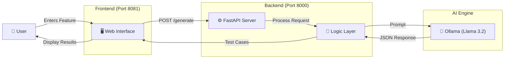

# Local AI Test Case Generator 🚀

A powerful, locally-hosted application that generates comprehensive software test cases from feature descriptions using a local Large Language Model (Llama 3.2).


## 🏗️ Architecture

How the project components interact to generate test cases:



## ✨ Features

*   **100% Local & Private:** No data leaves your machine.
*   **Zero Cost:** Uses your local hardware via Ollama.
*   **Structured Output:** Generates ready-to-use test cases in a standard format.
*   **Robust Architecture:** Decoupled frontend and backend managed by PM2.

## 🛠️ Prerequisites

Before running the application, ensure you have the following installed:

1.  **[Ollama](https://ollama.com/)**: To run the AI model.
    *   Once installed, pull the model:
        ```bash
        ollama pull llama3.2
        ```
2.  **Node.js & npm**: To run the process manager (PM2).
3.  **Python 3.10+**: To run the backend server.

## 🚀 Quick Start

We have provided a single script to handle deployment and startup.

### 1. Clone the Repository
```bash
git clone https://github.com/Gpalak21/Local-TestCase-Generator.git
cd Local-TestCase-Generator
```

### 2. Install Python Dependencies
```bash
pip install fastapi uvicorn pydantic ollama
```

### 3. Start the Application
Run the deployment script. This will install PM2 (if missing) and start both frontend and backend services.

```bash
chmod +x start_deployment.sh
./start_deployment.sh
```

### 4. Access the App
Open your browser and navigate to:
**[http://localhost:8081](http://localhost:8081)**

## 🎮 Usage

1.  Open the web interface at `http://localhost:8081`.
2.  Type a feature description in the chat box.
    *   *Example: "A login page with email validation and 'Forgot Password' link."*
3.  Press **Enter** or click **Send**.
4.  The AI will generate detailed test cases including:
    *   Preconditions
    *   Step-by-step instructions
    *   Expected results
    *   Priority & Type

## ⚙️ Managing the Services

The application uses **PM2** to keep the services running in the background.

| Action | Command |
| :--- | :--- |
| **Check Status** | `npx pm2 list` |
| **View Logs** | `npx pm2 logs` |
| **Restart All** | `npx pm2 restart all` |
| **Stop All** | `npx pm2 stop all` |

## 📁 Project Structure

```
Local-TestCase-Generator/
├── backend/
│   ├── server.py          # FastAPI Backend Entrypoint
│   └── tools/
│       ├── generate.py    # AI Generation Logic
│       └── models.py      # Data Models (Pydantic)
├── frontend/
│   ├── index.html         # Main User Interface
│   ├── script.js          # Frontend Logic
│   └── style.css          # Styling
├── ecosystem.config.js    # PM2 Configuration
└── start_deployment.sh    # One-click startup script
```
